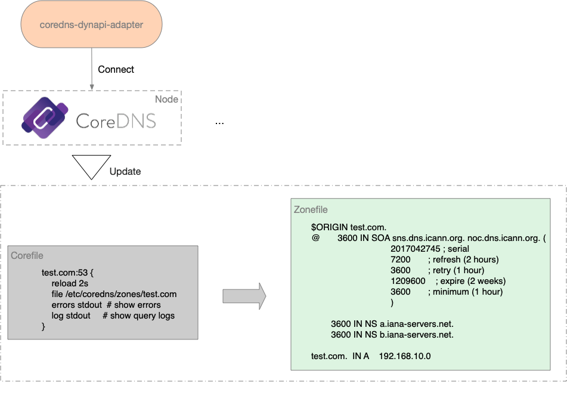

coredns-dynapi-adapter
===================

coredns-dynapi-adapter is a coredns dynamic middleware apiserver adapter which is implemented based on [GinAPIServer](https://github.com/duyanghao/GinAPIServer).

## Introduction

Currently coredns doesn't support dynamic domain CRUD APIs, which is urgently needed in a constantly changing environment of domains.

To solve this, coredns-dynapi-adapter, acts as a middleware adapter, helps users to manage coredns by providing some commonly used CRUD APIs.

## Run

coredns-dynapi-adapter can be run outside of the kubernetes as below:

```bash
$ bash hack/start.sh
```

In the meantime, running cluster-coredns-controller inside a kubernetes is also supported:

```bash
# generated image
$ make dockerfiles.build
# retag and push to your docker registry
$ docker tag duyanghao/coredns-dynapi-adapter:v0.1.0 xxx/duyanghao/coredns-dynapi-adapter:v0.1.0
$ docker push xxx/duyanghao/coredns-dynapi-adapter:v0.1.0
# Update the deployment to use the built image name
$ sed -i 's|REPLACE_IMAGE|xxx/duyanghao/coredns-dynapi-adapter:v0.1.0|g' hack/deploy/deployment.yaml
# create service 
$ kubectl apply -f hack/deploy/service.yaml
# create deployment
$ kubectl apply -f hack/deploy/deployment.yaml
```

## Principle

When receiving requests, coredns-dynapi-adapter will connect remote registered nodes and then update relevant contents of both corefile and zonefile of coredns.

The whole process is quite simple and can be illustrated as follows:

 
   
* Step1 - Register Node

This API helps to register node to coredns-dynapi-adapter:  
 
```bash
$ curl -X POST "http://x.x.x.x:8081/api/v1/node" -H "accept: application/json" -H "Content-Type: application/json" -d "{ \"nodeInfos\": [ { \"address\": \"x.x.x.x\", \"password\": \"xxx\", \"port\": xxx, \"username\": \"xxx\" }, { \"address\": \"x.x.x.x\", \"password\": \"xxx\", \"port\": xxx, \"username\": \"xxx\" } ]}"
{"code":0,"message":"Register Node success.","data":null}
```

Notice that the registered node information struct is defined as list, which means you can register multiple nodes in one call. 

Also, you can get registered node information through `GET` Method:

```bash
$ curl -X GET "http://x.x.x.x:8081/api/v1/node" -H "accept: application/json"|python -m json.tool
{
    "code": 0,
    "data": {
        "nodeInfos": [
            {
                "address": "x.x.x.x",
                "password": "xxx",
                "port": xxx,
                "username": "xxx"
            },
            {
                "address": "x.x.x.x",
                "password": "xxx",
                "port": xxx,
                "username": "xxx"
            }
        ]
    },
    "message": "Get Node success."
}
```

* Step2 - Add Domain

This API aims to add dynamic domain and its relevant ip to coredns:

```bash
$ curl -X POST "http://x.x.x.x/api/v1/domain" -H "accept: application/json" -H "Content-Type: application/json" -d "{ \"domainInfos\": [ { \"domain\": \"test.com\", \"ip\": \"x.x.x.x\" }, { \"domain\": \"test2.com\", \"ip\": \"x.x.x.x\" } ]}"
```

Notice that the domain information struct is defined as list, which means you can add multiple domains in one call.

Theoretically, you can access these domains through registered node nameservers after this call:

```bash
$ dig test.com
[...truncate...] 
```    

## Refs

* [GinAPIServer](https://github.com/duyanghao/GinAPIServer)
* [[WIP] Dynamic updates API with listen server](https://github.com/coredns/coredns/pull/1822)
* [[WIP] Add `dynapi` plugin](https://github.com/coredns/dynapi/pull/1)
